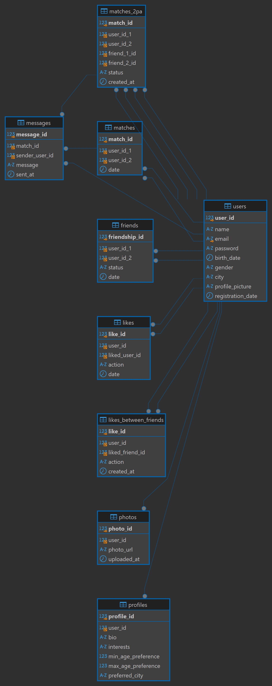

# back-end
# Match 2PA - Sistema de Citas Dobles 

Este sistema permite realizar **matches individuales** y **matches dobles (2PA)**, donde los amigos de un usuario pueden conocer a los amigos de su match. La app gestiona **likes, matches, chats y sugerencias inteligentes**.

---

## **Estructura de la Base de Datos**

### **1️⃣ users (Usuarios)**
Guarda los datos de cada usuario.

| Campo             | Tipo        | Descripción                   |
|------------------|------------|-------------------------------|
| user_id         | INT (PK)   | Identificador único de usuario |
| name           | VARCHAR    | Nombre del usuario            |
| username           | VARCHAR    | Nickname del usuario            |
| email          | VARCHAR    | Correo electrónico            |
| password       | VARCHAR    | Contraseña encriptada         |
| birth_date     | DATE       | Fecha de nacimiento           |
| gender         | VARCHAR    | Género                        |
| city          | VARCHAR    | Ciudad                        |
| profile_picture | VARCHAR    | URL de la foto de perfil      |
| registration_date | TIMESTAMP | Fecha de registro            |

---

### **2️⃣ profiles (Perfiles de Usuario)**
Almacena información adicional para sugerencias de matches.

| Campo                | Tipo        | Descripción                      |
|----------------------|------------|----------------------------------|
| profile_id         | INT (PK)   | Identificador del perfil        |
| user_id           | INT (FK)   | Relación con `users`            |
| bio              | TEXT       | Descripción del usuario         |
| interests        | TEXT       | Intereses del usuario           |
| min_age_preference | INT        | Edad mínima preferida          |
| max_age_preference | INT        | Edad máxima preferida          |
| preferred_city    | VARCHAR    | Ciudad preferida para matches  |

---

### **3️⃣ photos (Fotos de Usuario)**
Cada usuario puede subir múltiples fotos a su perfil.

| Campo     | Tipo      | Descripción |
|-----------|----------|-------------|
| photo_id | INT (PK) | ID de la foto |
| user_id  | INT (FK) | Usuario dueño de la foto |
| url      | VARCHAR  | URL de la imagen |

---

### **4️⃣ friends (Amigos)**
Registra las conexiones entre amigos.

| Campo       | Tipo      | Descripción |
|------------|----------|-------------|
| friendship_id | INT (PK) | ID de la amistad |
| user_id_1  | INT (FK) | Usuario 1 |
| user_id_2  | INT (FK) | Usuario 2 |
| status     | VARCHAR  | Estado (pendiente, aceptado) |
| date       | TIMESTAMP | Fecha de amistad |

---

### **5️⃣ likes (Likes Individuales)**
Almacena los likes entre usuarios individuales.

| Campo     | Tipo      | Descripción |
|-----------|----------|-------------|
| like_id  | INT (PK) | ID del like |
| user_id  | INT (FK) | Usuario que da like |
| liked_user_id | INT (FK) | Usuario que recibe el like |
| action   | VARCHAR  | Acción ('like' o 'superlike') |
| date     | TIMESTAMP | Fecha del like |

---

### **6️⃣ matches (Matches Individuales)**
Cuando dos usuarios se dan like mutuamente, se genera un match.

| Campo    | Tipo      | Descripción |
|----------|----------|-------------|
| match_id | INT (PK) | ID del match |
| user_id_1 | INT (FK) | Usuario 1 |
| user_id_2 | INT (FK) | Usuario 2 |
| date      | TIMESTAMP | Fecha del match |

---

### **7️⃣ likes_between_friends (Likes Entre Amigos)**
Permite que los amigos de un usuario den like a los amigos de su match.

| Campo       | Tipo      | Descripción |
|------------|----------|-------------|
| like_id    | INT (PK) | ID del like |
| user_id    | INT (FK) | Usuario que da like |
| liked_friend_id | INT (FK) | Amigo del match al que da like |
| date       | TIMESTAMP | Fecha del like |

---

### **8️⃣ matches_2pa (Matches Dobles - 2PA)**
Cuando dos pares de amigos se dan like, se crea un match doble.

| Campo       | Tipo      | Descripción |
|------------|----------|-------------|
| match_2pa_id | INT (PK) | ID del match 2PA |
| user_1a    | INT (FK) | Usuario 1 del primer par |
| user_1b    | INT (FK) | Usuario 2 del primer par |
| user_2a    | INT (FK) | Usuario 1 del segundo par |
| user_2b    | INT (FK) | Usuario 2 del segundo par |
| date       | TIMESTAMP | Fecha del match |

---

### **9️⃣ messages (Mensajes)**
Guarda los mensajes en chats individuales o grupales.

| Campo         | Tipo      | Descripción |
|--------------|----------|-------------|
| message_id  | INT (PK) | ID del mensaje |
| match_id    | INT (FK) | Relación con `matches` o `matches_2pa` |
| sender_user_id | INT (FK) | Usuario que envió el mensaje |
| message     | TEXT     | Contenido del mensaje |
| date        | TIMESTAMP | Fecha del mensaje |

---

## **Funcionamiento**

###  **1. Match Individual**
1️⃣ Un usuario da like a otro (`likes`).  
2️⃣ Si ambos se dan like, se crea un `match` en `matches`.  
3️⃣ Ahora pueden enviarse mensajes en `messages`.  
4️⃣ Sus amigos se desbloquean en el swipe.  

---

### **2. Amigos en el Swipe (Match 2PA)**
1️⃣ Tras un match individual, los amigos del usuario con el que hiciste match aparecen con **prioridad** en el swipe.  
2️⃣ Si un amigo tuyo da like a un amigo del match (`likes_between_friends`), se guarda el like.  
3️⃣ Si es mutuo, se genera un `match_2pa` y se abre un **chat grupal** en `messages`.  

**Ejemplo:**  
- **Carlos y Ana hacen match.**  
- Ahora **los amigos de Carlos** aparecen primero en el swipe de Ana, y viceversa.  
- **Juan (amigo de Carlos) le da like a Sofía (amiga de Ana).**  
- Sofía le devuelve el like.  
- **¡Boom! Se crea un match 2PA entre (Carlos y Juan) con (Ana y Sofía).**  

---

###  **3. Chat Individual y Chat de Grupo**
1️⃣ Si hay un **match individual**, los usuarios pueden enviarse mensajes en `messages`.  
2️⃣ Si hay un **match 2PA**, se crea un **chat grupal** para los 4.  

---

##  **¿Cómo Mostrar los Amigos en el Swipe?**
🔹 **Priorizar amigos del match en la búsqueda.**  

